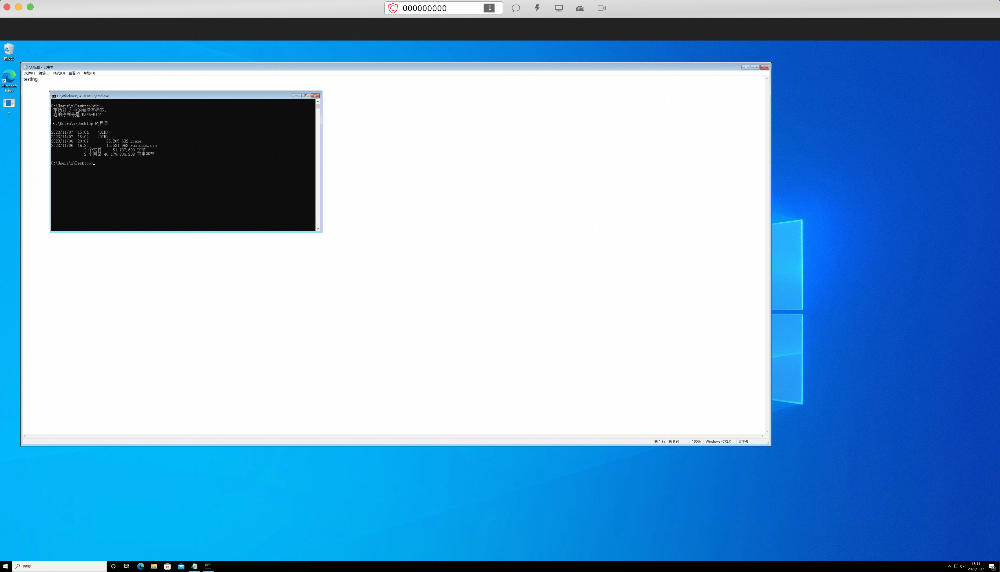
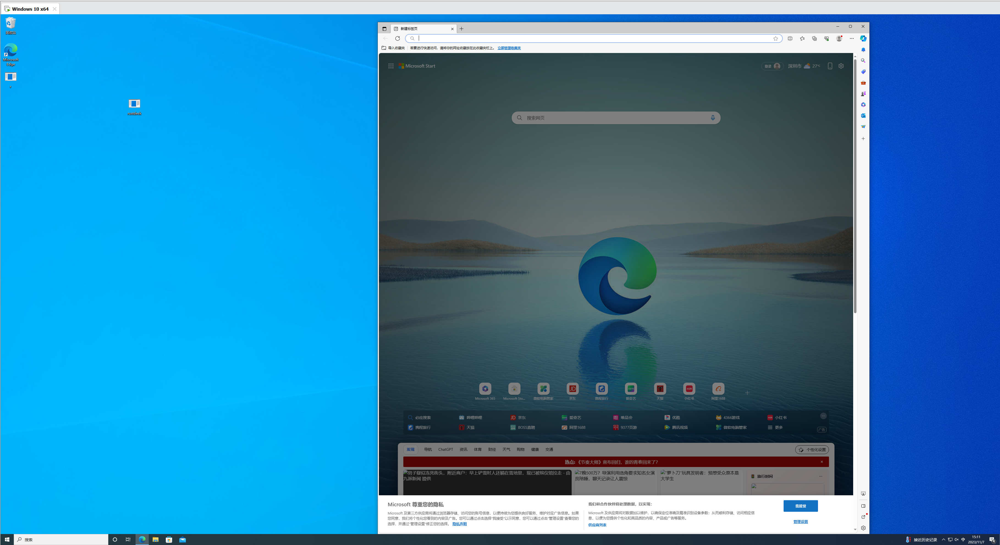

## rustdesk-hvnc

It's a HVNC client based on RustDesk, by rewriting **screen capturing** and **keyboard and mouse handling** of RustDesk.

It's compatible with original edition RustDesk server.

## Usage

1. start rustdesk-hvnc client `./rustdesk-hvnc IP_OF_RUSTDESK_SERVER CONNECT_ID`.
2. connect it with a original edition RustDesk client, submit any non-empty password.
3. use chat box to start explorer.exe.
4. enjoy.

## Credits

+ [rustdesk](https://github.com/rustdesk/rustdesk)
+ [Meltedd/HVNC](https://github.com/Meltedd/HVNC)
+ [qwqdanchun/HVNC](https://github.com/qwqdanchun/HVNC)